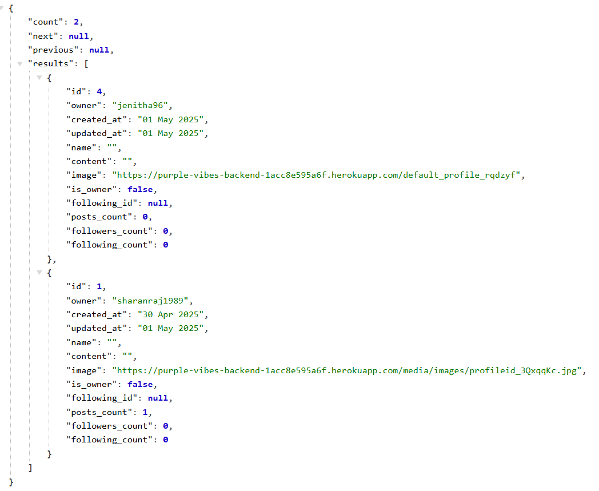
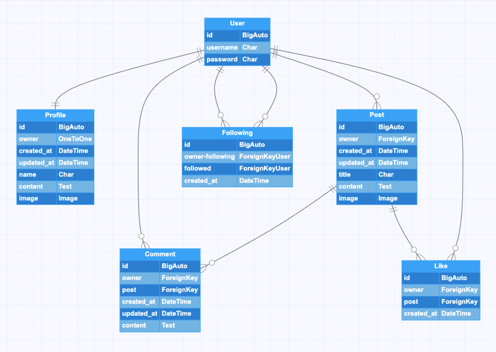
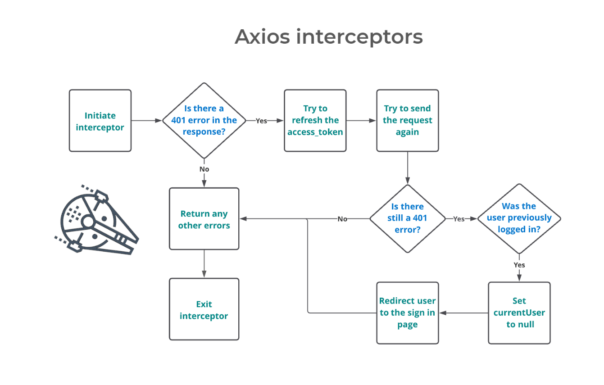

# 💜 Purple Vibes Backend API

The **Purple Vibes API** is a robust RESTful API built using **Django** and the **Django REST Framework (DRF)**. It powers the backend of a dynamic content-sharing and social storytelling platform, enabling features like user authentication, posting stories, following other users, liking content, and leaving feedback. Designed for scalability and flexibility, this backend integrates seamlessly with a React-based frontend.

---

## 🚀 Live Site

Access the deployed API here:
👉 **[https://purple-vibes-backend-1acc8e595a6f.herokuapp.com/](https://purple-vibes-backend-1acc8e595a6f.herokuapp.com/)**

> 📝 **Note**: This README is for the back-end API only. For front-end documentation, visit the [Purple Vibes Front-End Repo](https://github.com/ozi-cheri/voyage).

---

## 📚 Table of Contents

* [📖 Project Overview](#-project-overview)
* [🌀 Agile Methodology](#-agile-methodology)
* [🧠 Wireframes](#-wireframes)
* [🛠 Technologies Used](#-technologies-used)
* [🗃 Database](#-database)
* [✅ Testing](#-testing)
* [🚢 Deployment](#-deployment)
* [🙌 Credits](#-credits)

---

## 📖 Project Overview

**Purple Vibes** is a community-driven platform focused on storytelling and connection. The API supports the following core features:

* 🧑‍💻 **User Registration & JWT Authentication**
* 📝 **Post Creation & Management** (CRUD functionality)
* ❤️ **Like & Follow Systems** for engagement
* 💬 **Feedback/Comment System**
* 🖼 **Media Uploads** via **Cloudinary**
* 🔒 **Secure** and **Scalable** architecture using PostgreSQL

This API is optimized for performance and designed with modularity in mind, enabling seamless interaction with the front-end built in React.

---

## 🌀 Agile Methodology

Development followed an **Agile** workflow to promote:

* Continuous integration of feedback
* Iterative development
* Visibility through regular updates and reviews

📌

## 🧠 Wireframes

Visual blueprints were created during the planning phase to guide UI/UX design and endpoint structure.

> *(Include images or links to wireframes if available)*

---

## 🛠 Technologies Used

| Tool/Library              | Purpose                                                            |
| ------------------------- | ------------------------------------------------------------------ |
| **Django**                | Core backend framework                                             |
| **Django REST Framework** | Simplifies API development with serializers, viewsets, and routers |
| **PostgreSQL**            | Relational database for scalable and secure data storage           |
| **Cloudinary**            | Image and media upload/management                                  |
| **JWT Authentication**    | Secure token-based authentication                                  |
| **Gunicorn**              | WSGI HTTP server for deploying Django apps                         |
| **Heroku**                | Cloud platform for deployment                                      |

---

## 🗃 Database

The API uses **PostgreSQL**, hosted via **Code Institute's provisioned database service**, to store data for:

* User profiles
* Stories/posts
* Likes and follows
* Comments and feedback

Django’s ORM (Object-Relational Mapping) ensures data integrity and model relationships.

---

## ✅ Testing

Comprehensive testing was performed to ensure API reliability and robustness.

🔗 See full testing details here: [TESTING.md](TESTING.md)

Types of tests include:

* ✅ Unit Tests for individual components
* 🔄 Integration Tests for multi-part workflows
* 🔐 Authentication and authorization checks
* 🧪 Manual front-end integration validation

---

## 🚢 Deployment

The app is deployed on **Heroku** with the following setup:

* **Gunicorn** used as the WSGI server
* **Cloudinary** used for media file management
* **PostgreSQL** provisioned via Heroku or Code Institute’s platform
* Environment variables managed securely

🧭 Full instructions: [DEPLOYMENT.md](DEPLOYMENT.md)

---

## 🙌 Credits

* Based on and inspired by the **Code Institute DRF API walkthrough**
* Special thanks to **Code Institute**, mentors, and reviewers
* Assets, icons, and libraries from open-source communities

---

