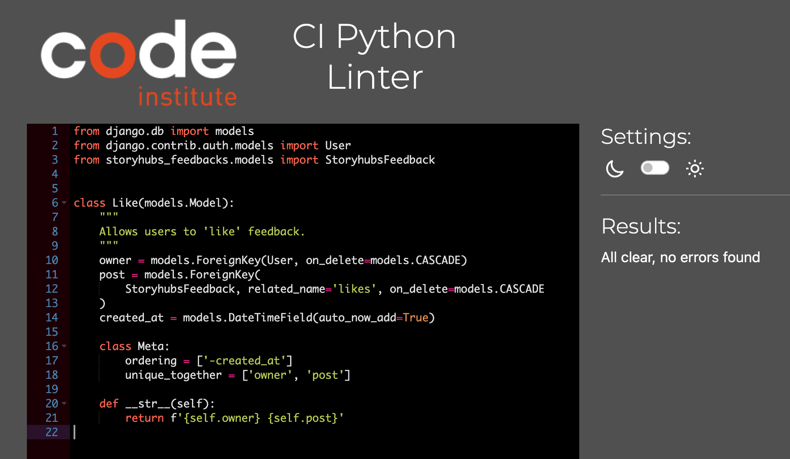
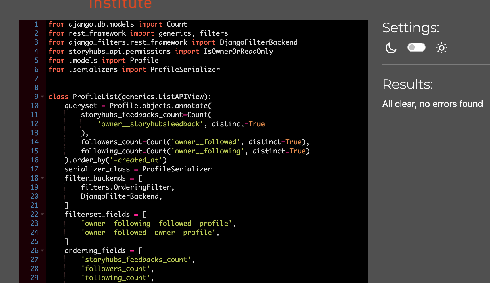

# 💜 **Purple Vibes Backend API**

### 🧪 Testing Documentation

---

## 📑 Table of Contents

* [✅ Code Validation](#-code-validation)
* [🤖 Automated Testing](#-automated-testing)
* [🧍 Manual Testing](#-manual-testing)
* [🐞 Known Bugs](#-known-bugs)

---

## ✅ Code Validation

All Python files in the Purple Vibes API have been linted for PEP8 compliance using `pycodestyle`.

### 🔧 Setup Instructions

```bash
pip3 install pycodestyle
```

Steps to configure linter in GitPod:

1. Press `Ctrl + Shift + P`
2. Search and select **Python: Select Linter**
3. Choose **pycodestyle**
4. Go to the top-left menu → `View` → `Problems` to see lint results

---

### 🗂️ Validation Results

**All files passed with 0 errors or warnings.**

#### 📁 Posts App

* `models.py`
* `serializers.py`
* `tests.py`
* `urls.py`
* `views.py`




#### 📁 Comments App

* `models.py`
* `serializers.py`
* `tests.py`
* `urls.py`
* `views.py`

#### 📁 Profiles App

* `models.py`
* `serializers.py`
* `tests.py`
* `urls.py`
* `views.py`

#### 📁 Followers App

* `models.py`
* `serializers.py`
* `tests.py`
* `urls.py`
* `views.py`

#### 📁 Likes App

* `models.py`
* `serializers.py`
* `tests.py`
* `urls.py`
* `views.py`

---

## 🤖 Automated Testing

Each core feature has a comprehensive set of automated tests. Here's a breakdown of what's covered:

---

### 👤 **Profiles**

| Test                                       | Status |
| ------------------------------------------ | ------ |
| Auto-create profile on user sign-up        | ✅      |
| List, retrieve, update, delete own profile | ✅      |
| Restrict actions on other users' profiles  | ✅      |

---

### 📝 **Posts**

| Test                           | Status |
| ------------------------------ | ------ |
| Create post (logged-in only)   | ✅      |
| List and retrieve posts        | ✅      |
| Update/delete own post only    | ✅      |
| Restrict editing others' posts | ✅      |

---

### 💬 **Comments**

| Test                              | Status |
| --------------------------------- | ------ |
| Add comment (logged-in only)      | ✅      |
| List/retrieve comments            | ✅      |
| Edit/delete own comment           | ✅      |
| Restrict editing others' comments | ✅      |

---

### ❤️ **Likes**

| Test                         | Status |
| ---------------------------- | ------ |
| Like a post (logged-in only) | ✅      |
| View list of likes           | ✅      |
| Prevent duplicate likes      | ✅      |
| Delete own like              | ✅      |

---

### 👥 **Followers**

| Test                              | Status |
| --------------------------------- | ------ |
| Follow/unfollow a profile         | ✅      |
| View list of followers/following  | ✅      |
| Prevent duplicate follows         | ✅      |
| Restrict deleting others’ follows | ✅      |

---

## 🧍 Manual Testing

In addition to automated tests, thorough manual testing was performed using the live API endpoints and admin dashboard.

---

### 👤 **Profiles**

| Feature                                       | Status |
| --------------------------------------------- | ------ |
| Order by followers/following count (asc/desc) | ✅      |
| Filter by following/followed relationships    | ✅      |

---

### 📝 **Posts**

| Feature                                 | Status |
| --------------------------------------- | ------ |
| Order by like/comment count (asc/desc)  | ✅      |
| Search by title or owner                | ✅      |
| Filter by followed users or liked posts | ✅      |

---

### 💬 **Comments**

| Feature                 | Status |
| ----------------------- | ------ |
| Filter comments by post | ✅      |

---

## 🐞 Known Bugs

### ✅ Resolved Issues

1. **Tag Field Required**
   Taggit field incorrectly marked as required despite `blank=True`. Tests were updated to include tags, resolving the issue.

2. **Followers List URL**
   Test failed due to missing `/` in endpoint. Adding the trailing slash fixed the issue.

3. **Permission Misconfiguration**
   Discovered logged-out users could like/comment due to incorrect permissions. Adjusted `permissions.py`; tests now pass as expected.

---

## 🔙 [Return to README](README.md)

---

